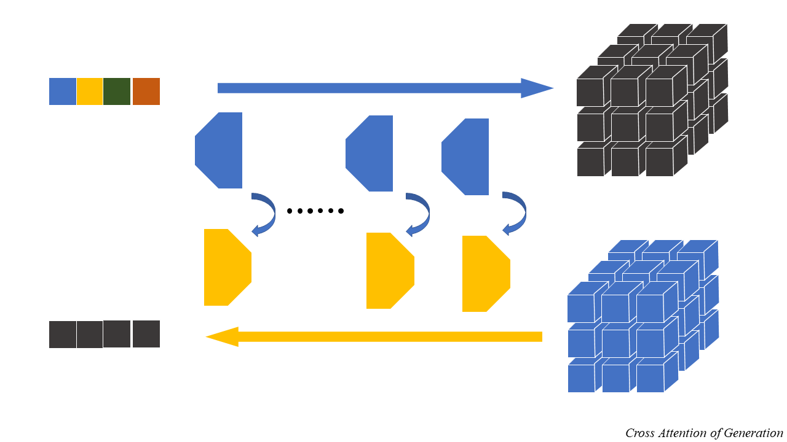

# Notes
## 20220903 init @sch
这是一个叫Cross Attention的模型, 模型有两部分: Generation和Encoder. Generation前向传播不依赖于Encoder, 而Encoder前向传播需要Generation提供Value和Key. 反向传播时, 两部地方可以使用不同的优化器. 

按设计的想法来说, Generation可以迁移到其他任务中, 并使用较小学习率的优化器或者固定Generation的参数.

# TODO
- [ ] 完成原始模型的构建
- [ ] 使用图像分类任务训练
- [ ] 使用文本分类任务继续训练
- [ ] 探索更多的Generation骨架, Key&Value的生成方式
- [ ] 探索更多的Encoder骨架
- [ ] 探索其他的Cross方式

# Model Design Graph
